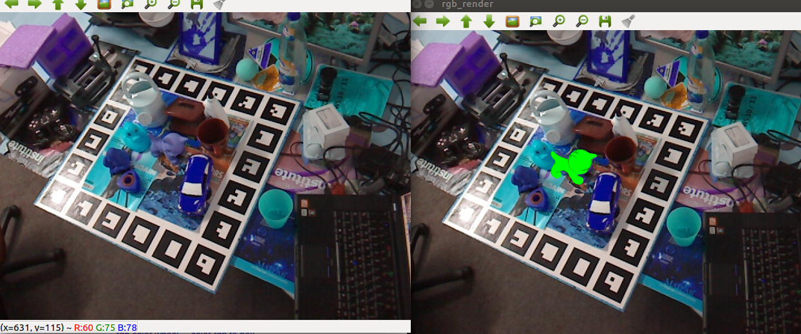
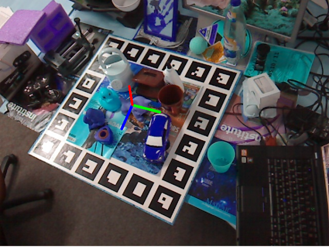
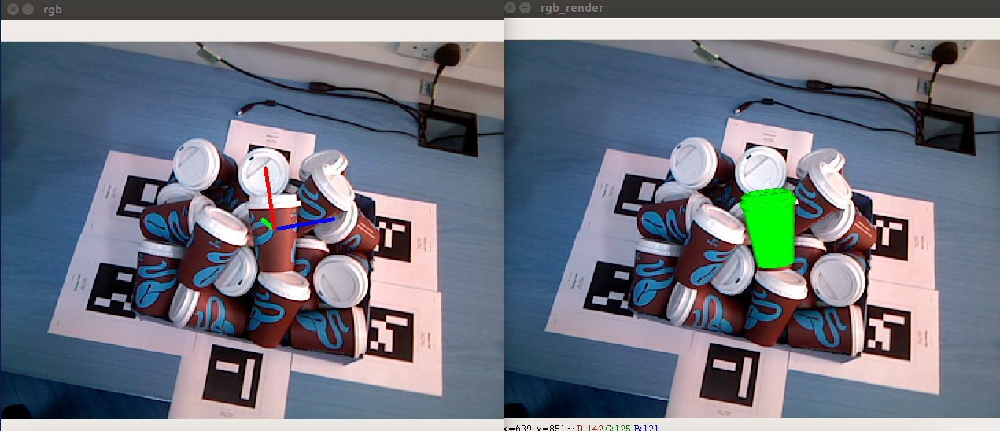

# 6DPose

implement some algorithms of 6d pose estimation  

- [x] linemod
- [x] linemod levelup
- [ ] linemod ros
- [ ] latent class hough tree(LCHF)
- [x] 3d convex segmentation  

note: LCHF is too hard to tune params so I'm not going to implement it...  
[a better choice: patch_linemod](https://github.com/meiqua/patch_linemod)

## prerequisite

### pysixd

files: params/  pysixd/  t_less_toolkit/  tools/  
copied from [sixd_toolkit](https://github.com/thodan/sixd_toolkit)  
deal with model reading/rendering, datasets reading and evaluation  

### dataset

get dataset under 6DPose folder using following cmd  
```
wget -r -np -nH --cut-dirs=1 -R index.html http://ptak.felk.cvut.cz/6DB/public/
```

### library

install opencv3 with contrib rgbd module  
install pybind11  

pip3 install -r requirements.txt

### steps

in target folder:  
mkdir build  
cd build/  
cmake ..  
make  

in 6dpose folder, if use pybind:  
pip3 install target_folder/  

python3 target.py

## linemod

Codes in linemod.py will train and detect objects in downloaded dataset.  
Refer to opencv linemod and ork linemod src  

### result

  


## linemodLevelup

Linemod suffers a lot from scale and occlusion problems, to deal wtih
them:  
1. set low response closer to zero;(idea got from focal loss)  
2. use depth histgram and 1D nms to find some primary scales  
 
ori linemod can't run while our features are more than 64, due to 8bit SSE.
after changing to 16bit SSE and preventing overflow,
we can have up to 8192 features now.


[Chinese blog about the ideas](https://zhuanlan.zhihu.com/p/35683990)  

[some tests](./linemodLevelup/readme.md)  

## linemod ros  

run linemod with ros for real test, not done yet

## latent class hough forest --- LCHF  

- [x] linemod patch version
- [x] hough forest
- [ ] meanshift for leaf mode
- [ ] icp for pose refine
- [ ] train and test  

[Chinese blog 0](https://zhuanlan.zhihu.com/p/35710562)  
[Chinese blog 1](https://zhuanlan.zhihu.com/p/35740328)  

## 3d convex segmentation

segment 3d cloud to convex part, core func have been done, try to deploy now  
### result of cloud_seg.py

 
NOTE: To use pybind, static super4pcs must be built with flag -fPIC.
Build super4pcs using following lines:    
```
mkdir build
cd build
cmake .. -DCMAKE_CXX_FLAGS="-fpic"
make
sudo make install
```
[separated repo for deployment](https://github.com/meiqua/binPicking_3dseg)  

[Chinese blog](https://zhuanlan.zhihu.com/p/36419676)
