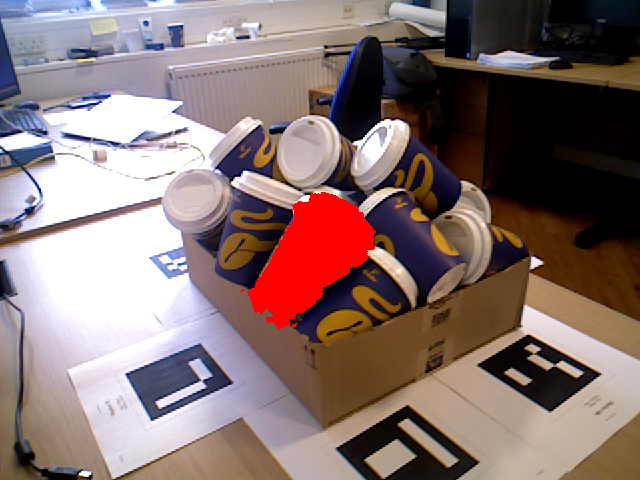
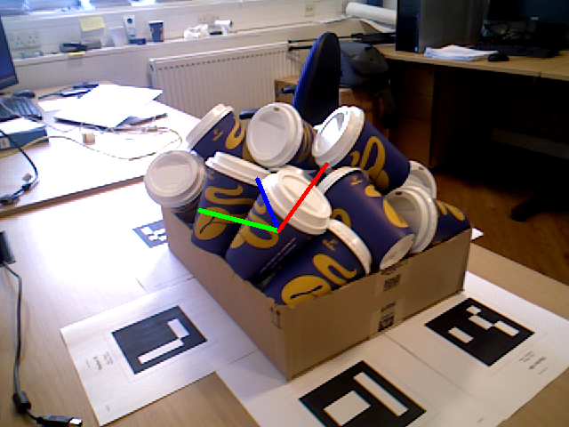

## bin picking use 3d seg and super4pcs  
This repo is separated from 6d pose repo, because ori repo is too big
to deploy.  

Briefly speaking, we seg the point cloud by convex criteria (any point's
tangent plane is not intersected with cloud), then use super4pcs to find 
6d pose. We try ICP also but not help. Seg costs 0.3s, and pcs costs 1s 
for 1 obj.

[a blog in chinese](https://zhuanlan.zhihu.com/p/36419676)

Following are our current test result:  
  

  

to do: real test for bin picking  
